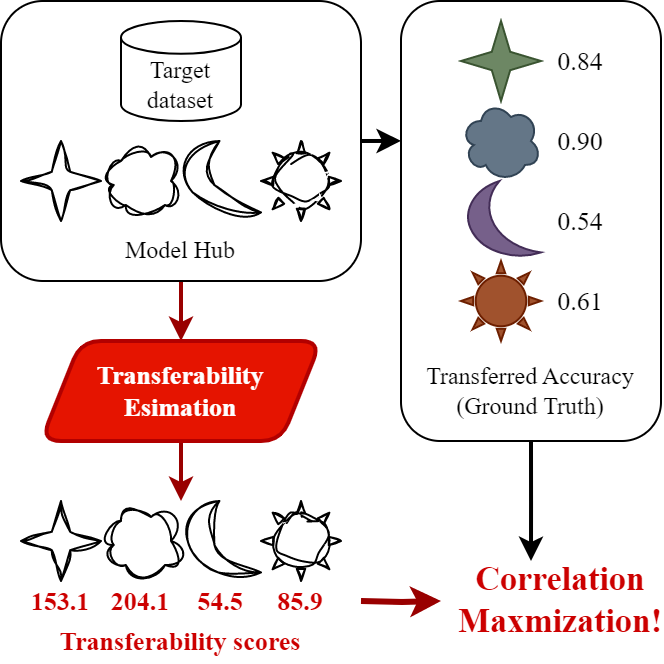
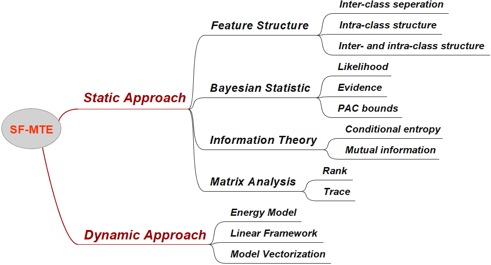
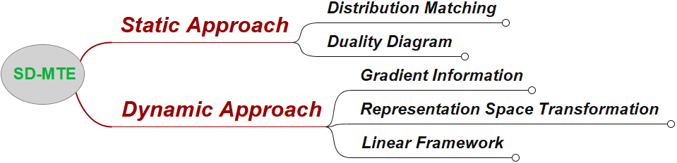

# awesome-model-transferability-estimation

A collection of model transferability estimation methods. 

This repo is still in progress.

## Source-independent

#### 2024
- Bridge the Modality and Capacity Gaps in Vision-Language Model Selection [[ArXiv]](http://arxiv.org/abs/2403.13797)
- Zero-Shot Embeddings Inform Learning and Forgetting with Vision-Language Encoders [[ArXiv]](http://arxiv.org/abs/2407.15731)

#### 2023
-  Model Spider: Learning to Rank Pre-Trained Models Efficiently [[Arxiv]](https://arxiv.org/abs/2306.03900)
-  Towards Estimating Transferability using Hard Subsets [[ArXiv]](https://arxiv.org/abs/2301.06928)
- Pick the Best Pre-trained Model: Towards Transferability Estimation for Medical Image Segmentation [[MICCAI]](https://arxiv.org/pdf/2307.11958.pdf)
-  Transferability Metrics for Object Detection [[ArXiv]](https://arxiv.org/abs/2306.15306)
- Fast and Accurate Transferability Measurement by Evaluating Intra-class Feature Variance[[ArXiv]](https://arxiv.org/pdf/2308.05986.pdf)
- ETran: Energy-Based Transferability Estimation [[ICCV]](https://openaccess.thecvf.com/content/ICCV2023/html/Gholami_ETran_Energy-Based_Transferability_Estimation_ICCV_2023_paper.html)
- How Far Pre-trained Models Are from Neural Collapse on the Target Dataset Informs their Transferability [[ICCV]](https://openaccess.thecvf.com/content/ICCV2023/html/Wang_How_Far_Pre-trained_Models_Are_from_Neural_Collapse_on_the_ICCV_2023_paper.html)
- Exploring Model Transferability through the Lens of Potential Energy[[ICCV]](https://openaccess.thecvf.com/content/ICCV2023/html/Li_Exploring_Model_Transferability_through_the_Lens_of_Potential_Energy_ICCV_2023_paper.html)
- Unleashing the power of Neural Collapse for Transferability Estimation [[ArXiv]](https://arxiv.org/abs/2310.05754)
- Foundation Model is Efficient Multimodal Multitask Model Selector [[ArXiv]](https://arxiv.org/abs/2308.06262)
- Towards Robust Multi-Modal Reasoning via Model Selection [[ArXiv]](https://arxiv.org/abs/2310.08446)
- Graph-based fine-grained model selection for multi-source domain [[PAA]](https://link.springer.com/article/10.1007/s10044-023-01176-6)
- Guided Recommendation for Model Fine-Tuning [[CVPR]](https://openaccess.thecvf.com/content/CVPR2023/html/Li_Guided_Recommendation_for_Model_Fine-Tuning_CVPR_2023_paper.html)
- Quick-Tune: Quickly Learning Which Pretrained Model to Finetune and How [[ArXiv]](https://arxiv.org/abs/2306.03828)
- Estimating the Transfer Learning Ability of a Deep Neural Networks by Means of Representations [[NCMLCR]](https://link.springer.com/chapter/10.1007/978-3-031-44865-2_50)
- Efficient Prediction of Model Transferability in Semantic Segmentation Tasks [[ICIP]](https://ieeexplore.ieee.org/abstract/document/10222912)
- The Performance of Transferability Metrics Does Not Translate to Medical Tasks [[MICCAI workshop]](https://link.springer.com/chapter/10.1007/978-3-031-45857-6_11)
- How to Determine the Most Powerful Pre-trained Language Model without Brute Force Fine-tuning? An Empirical Survey [[ArXiv]](https://arxiv.org/pdf/2312.04775.pdf)
- Guided recommendation for model fine-tuning [[CVPR]](http://openaccess.thecvf.com/content/CVPR2023/html/Li_Guided_Recommendation_for_Model_Fine-Tuning_CVPR_2023_paper.html)

#### 2022
- Newer is not always better: Rethinking transferability metrics, their peculiarities, stability and performance [[ECML PKDD]](https://arxiv.org/abs/2110.06893)
- Frustratingly Easy Transferability Estimation [[ICML]](https://proceedings.mlr.press/v162/huang22d.html) [[Slides]](https://icml.cc/media/icml-2022/Slides/17386.pdf)
- Transferability Estimation Using Bhattacharyya Class Separability [[CVPR]](https://openaccess.thecvf.com/content/CVPR2022/html/Pandy_Transferability_Estimation_Using_Bhattacharyya_Class_Separability_CVPR_2022_paper.html)
- Transferability Metrics for Selecting Source Model Ensembles [[CVPR]](https://openaccess.thecvf.com/content/CVPR2022/papers/Agostinelli_Transferability_Metrics_for_Selecting_Source_Model_Ensembles_CVPR_2022_paper.pdf)
- How stable are Transferability Metrics evaluations? [[ECCV]](https://arxiv.org/abs/2204.01403) [[TensorFlow]](https://github.com/google-research/google-research/tree/master/stable_transfer)
- Pre-Trained Model Reusability Evaluation for Small-Data Transfer Learning [[NeurIPS]](https://openreview.net/forum?id=XY5g3mkVge) [[Codes]](https://github.com/candytalking/SynLearn.)
- Pitfalls in Measuring Neural Transferability [[NeurIPSW]](https://openreview.net/forum?id=KWUA0n6Dpv&noteId=x7jdD7Ppug)
- Ranking and Tuning Pre-trained Models: A New Paradigm for Exploiting Model Hubs [[JMLR]](https://www.jmlr.org/papers/volume23/21-1251/21-1251.pdf)
- PACTran: PAC-Bayesian Metrics for Estimating the Transferability of Pretrained Models to Classification Tasks [[ECCV]](https://www.ecva.net/papers/eccv_2022/papers_ECCV/papers/136940244.pdf) [[Codes]](https://github.com/google-research/pactran_metrics)
- Evidence > Intuition: Transferability Estimation for Encoder Selection [[EMNLP]](https://arxiv.org/abs/2210.11255)
- Not All Models Are Equal: Predicting Model Transferability in a Self-challenging Fisher Space [[ECCV]](https://link.springer.com/chapter/10.1007/978-3-031-19830-4_17)
- Efficient Semantic Segmentation Backbone Evaluation for Unmanned Surface Vehicles based on Likelihood Distribution Estimation [[MSN]](https://ieeexplore.ieee.org/abstract/document/10076662)
- Pre-Trained Model Reusability Evaluation for Small-Data Transfer Learning [[NeurIPS]](https://proceedings.neurips.cc/paper_files/paper/2022/hash/f308b5f207348484552997c536375654-Abstract-Conference.html)

#### 2021
-  Ranking Neural Checkpoints [[CVPR]](https://openaccess.thecvf.com/content/CVPR2021/papers/Li_Ranking_Neural_Checkpoints_CVPR_2021_paper.pdf)
- LogME: Practical Assessment of Pre-trained Models for Transfer Learning [[ICML]](https://arxiv.org/abs/2102.11005) [[PyTorch]](https://github.com/thuml/LogME)
- Scalable Diverse Model Selection for Accessible Transfer Learning [[NeurIPS]](https://proceedings.neurips.cc/paper/2021/file/a1140a3d0df1c81e24ae954d935e8926-Paper.pdf) [[PyTorch]](https://github.com/dbolya/parc)
- A linearized framework and a new benchmark for model selection for fine-tuning [[ArXiv]](https://arxiv.org/pdf/2102.00084.pdf)

#### 2020
- LEEP: A New Measure to Evaluate Transferability of Learned Representations [[ICML]](https://arxiv.org/pdf/2002.12462) [[Slides]](https://dev.icml.cc/media/icml-2020/Slides/6289.pdf) [[PyTorch]](https://github.com/thuml/LogME)
- Source Model Selection for Deep Learning in the Time Series Domain [[IEEE Access]](https://ieeexplore.ieee.org/document/8949507)
- Ranking and rejecting of pre-trained deep neural networks in transfer learning based on separation index [[ArXiv]](https://arxiv.org/abs/2012.13717)

#### 2019
- Transferability and Hardness of Supervised Classification Tasks [[ICCV]](https://openaccess.thecvf.com/content_ICCV_2019/papers/Tran_Transferability_and_Hardness_of_Supervised_Classification_Tasks_ICCV_2019_paper.pdf) 
- An information theoretic approach to transferability in task transfer learning [[ICIP]](https://ieeexplore.ieee.org/document/8803726) [[Codes]](https://github.com/YaojieBao/An-Information-theoretic-Metric-of-Transferability)
- TASK2VEC: Task Embedding for Meta-Learning [[ICCV]](https://openaccess.thecvf.com/content_ICCV_2019/papers/Achille_Task2Vec_Task_Embedding_for_Meta-Learning_ICCV_2019_paper.pdf)

#### 2016
- Learning to Select Pre-trained Deep Representations with Bayesian Evidence Framework [[CVPR]](https://openaccess.thecvf.com/content_cvpr_2016/papers/Kim_Learning_to_Select_CVPR_2016_paper.pdf)

## Source-dependent

#### 2023
- Identifying Useful Learnwares for Heterogeneous Label Spaces [[ICML]](https://proceedings.mlr.press/v202/guo23l/guo23l.pdf)
-  Simple Transferability Estimation for Regression Tasks [[UAI]](https://proceedings.mlr.press/v216/nguyen23a.html)
- [Analysis of Task Transferability in Large Pre-trained Classifiers ](https://openreview.net/forum?id=HCMmC8DETj)
- To transfer or not transfer: Unified transferability metric and analysis [[ArXiv]](https://arxiv.org/abs/2305.07741)
- Building a Winning Team: Selecting Source Model Ensembles using a Submodular Transferability Estimation Approach [[ICCV]](https://openaccess.thecvf.com/content/ICCV2023/html/B_Building_a_Winning_Team_Selecting_Source_Model_Ensembles_using_a_ICCV_2023_paper.html)
- How to Estimate Model Transferability of Pre-Trained Speech Models? [[Interspeech]](https://arxiv.org/abs/2306.01015)

#### 2022
- Transferability-Guided Cross-Domain Cross-Task Transfer Learning [[ArXiv]](https://arxiv.org/abs/2207.05510)
- Transferability Estimation Based On Principal Gradient Expectation [[ArXiv]](http://arxiv.org/abs/2211.16299)

#### 2021
- A Mathematical Framework for Quantifying Transferability in Multi-source Transfer Learning [NeurIPS](https://openreview.net/forum?id=wQZWg82TWx)
- Transferability Estimation for Semantic Segmentation Task [[ArXiv]](https://arxiv.org/abs/2109.15242)
- OTCE: A Transferability Metric for Cross-Domain Cross-Task Representations [[CVPR]](https://openaccess.thecvf.com/content/CVPR2021/papers/Tan_OTCE_A_Transferability_Metric_for_Cross-Domain_Cross-Task_Representations_CVPR_2021_paper.pdf) [[Poster]](https://www.tbsi.edu.cn/wolt/tbsi_wolt2020/posters/tanyang.pdf)
- Practical Transferability Estimation for Image Classification Tasks [[ArXiv]](https://arxiv.org/abs/2106.10479)

#### 2020
- Duality diagram similarity: a generic framework for initialization selection in task transfer learning [[ECCV]](https://www.ecva.net/papers/eccv_2020/papers_ECCV/papers/123710494.pdf)

#### 2019
- Representation Similarity Analysis for Efficient Task taxonomy & Transfer Learning [[CVPR]](https://arxiv.org/pdf/1904.11740.pdf)
- Model reuse with reduced kernel mean embedding specification [[ArXiv]](https://arxiv.org/abs/2001.07135)

